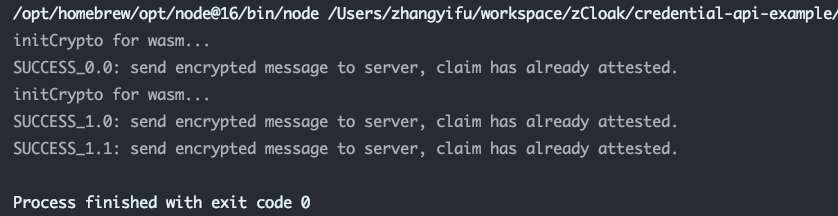

# Credential-API 使用说明

Hi👋，该仓库向您展示了如何使用我们的SDK来验证用户的claim信息并向其发送credential，以及如何直接向用户发送credential而无需用户提前创建claim信息。

各位Attester🧑🏻‍⚖️，准备好了么?🚀 让我们出发吧！！！

## 快速使用

```bash
git clone https://github.com/zCloak-Network/credential-api-example.git
cd credential-api-example/
npm install
ts-node cred-flow.ts
ts-node issue-cred.ts
```

## ⚠️ Issue Credential ⚠️
如果您的需求只是通过 API向 claimer直接发送 credential，您只需参考 `issue-cred.ts`文件。
👉开发教程可参考文章 [Issue Credential API Tutorial](./doc/issueCredentialApiTutorial-zh.md)。

## 使用向导
### Demo 文件说明
#### cred-flow.ts
脚本 `cred-flow.ts`向我们展示了如何对一个已经被创建过的claim进行验证，前提是用户已经在我们的 [credential平台](https://cred.zkid.app)创建过claim。
通过我们的脚本文件，提供 `receiver`, `sender` 以及 `msgType`即可对查询到的claim进行验证并发放credential，即如下代码部分：
```typescript
const params = [
  {
    receiver: "did:zk:0x4867c2Dfa7Aa14459c843d69220623cA97B652d7#key-1",
    sender: "did:zk:0xEdfdf6BCaa1A4c5Ed47f062Bbb51220A1001d2f7#key-1",
    msgType: "Request_Attestation",
  },
  {
    receiver: "did:zk:0x4867c2Dfa7Aa14459c843d69220623cA97B652d7#key-1",
    sender: "did:zk:0x2808e410610ae6077c6291CF3582Be5EDd2023cc#key-1",
    msgType: "Request_Attestation",
  }
];
```
在上面的代码中，我们对两个user（即sender）进行查询，通过运行脚本文件，我们可以得到下面的输出结果：


通过脚本的输出，我们看到sender为 `did:zk:0xEdfdf6BCaa1A4c5Ed47f062Bbb51220A1001d2f7#key-1`的用户只进行过一次创建claim的操作，
对其验证并发放credential可得到输出信息为SUCCESS_0.0，

同样，sender为 `did:zk:0x2808e410610ae6077c6291CF3582Be5EDd2023cc#key-1`的用户创建了两个claim，操作完成后得到的输出信息对应为SUCCESS_1.0与SUCCESS_1.1。

#### issue-cred.ts
脚本 `issue-cred.ts`向我们展示了如何向DID用户直接发放credential，通过该脚本无需用户提前创造claim即可将Attester自定义的任意credential
发放给该用户。

### 使用
我们支持 浏览器，node.js:
> npm install @zcloak/vc @zcloak/crypto @zcloak/message

```typescript
import { keys } from "@zcloak/did";
import { Keyring } from "@zcloak/keyring";
import { VerifiableCredentialBuilder } from "@zcloak/vc";
import { initCrypto } from "@zcloak/crypto";

import { decryptMessage, encryptMessage } from "@zcloak/message";

import { CType } from "@zcloak/ctype/types";
import { RawCredential, VerifiableCredential } from "@zcloak/vc/types";
import { Message, MessageType } from "@zcloak/message/types";

import * as qs from "qs";
import axios from "axios";

// 初始化noble的库与wasm
await initCrypto();

// 生成Attester Did账户
const mnemonic = '...';
const keyring = new Keyring();
const attester = keys.fromMnemonic(keyring, mnemonic, 'ecdsa');

// 加密与解密message
const encryptedMsg: Message<MessageType> = 'xxx';
const decrypted = await decryptMessage(encryptedMsg, attester);
const message = await encryptMessage("Response_Approve_Attestation", vc, attester, decrypted.sender, decrypted.id);

// 构建vcBuilder
const raw: RawCredential = 'xxx';
const ctype: CType = 'xxx';
const vcBuilder = VerifiableCredentialBuilder.fromRawCredential(raw, ctype)
    .setExpirationDate(null)
    .setIssuanceDate(Date.now());

// 构建vc (VerifiableCredential)
const vc: VerifiableCredential<false> = await vcBuilder.build(attester, false);
```

### API
## Q&A
